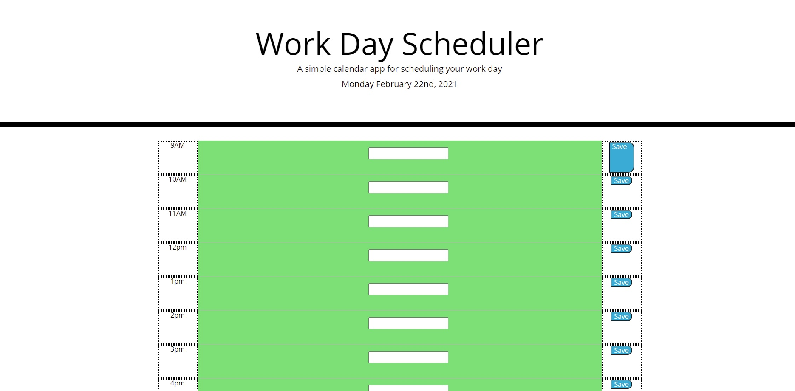

# Daily_Planner_jQuery
Modify an existing html and css to be a functioning day planner using jQuery.

---
## Author

Shawn Fox


| [GitHub](https://github.com/SFoxGit) | [Email](sfoxss4@gmail.com) |

---
## Project Links:

- Deployed site: [GitHub Pages]()
- GitHub: [SFoxGit]()

---
## Table of Contents

- [Description](##Description)

- [Requirements](##Requirements)

- [Progress](##Progress)

- [Contributions](##Contributing)

- [Credits](##Credits)

---
## Description

```md
AS AN employee with a busy schedule
I WANT to add important events to a daily planner
SO THAT I can manage my time effectively
```

---
## Requirements

```md
GIVEN I am using a daily planner to create a schedule
WHEN I open the planner
THEN the current day is displayed at the top of the calendar
WHEN I scroll down
THEN I am presented with timeblocks for standard business hours
WHEN I view the timeblocks for that day
THEN each timeblock is color coded to indicate whether it is in the past, present, or future
WHEN I click into a timeblock
THEN I can enter an event
WHEN I click the save button for that timeblock
THEN the text for that event is saved in local storage
WHEN I refresh the page
THEN the saved events persist
```

---
### Must include:

    
---
## Progress

Step one:

*Going over provided code*

    After reading instructions, first step was to add all the provided files to the repo as well as link them together in the html. I'm going to need to code the timeblocks, luckily I don't have to do them dynamically. I do need to save the user input into local storage, and retreive that information upon refresh. I am not sure if the events should auto delete upon new day. Im not sure if there is an easy solution with date validation, but I could probably make a button that just clears local storage which might be funny. Since the html is bootstrap, I think the timeblocks are probably 1-10-1 columns. I need to work with moment JS to compare current local time to the planner time and update the background color. I could probably get away with not using am/pm or military time since it's a 9-5 and thus no duplicates but might as well just use military might depend on moments. 

Step two:

*Html*

    Creating the table with time/input/button using bootstrap was pretty easy. I am super unsure if the input portion is right, I am going to have to ask in office hours. I probably could have been clever and just dynamically created each hour. CSS being already done, I had to ensure I used the same classes as the css. Most of this was just layout work. Current hang up in the bootstrap for the buttons, they aren't stretching to fit the div they are in. Im wondering if maybe they don't go in a div, same with the input, also if maybe they should be in a form. 



    As you can see I added dotted border to illustrate they aren't filling up the div.

Step three:

*Javascript*

    First thing I needed to do was display the date with moment, easy enough. Created a var for the military time currently. The background of the input section needs to be updated based on time so added data attributes to each div in military time same format as our var. Added a simple if statement which I actually got on the first try! Those moments feel great, pun sort of intended. 

---
## Contributing


---
## Credits

Existing code provided by: Trilogy Education Services, LLC
